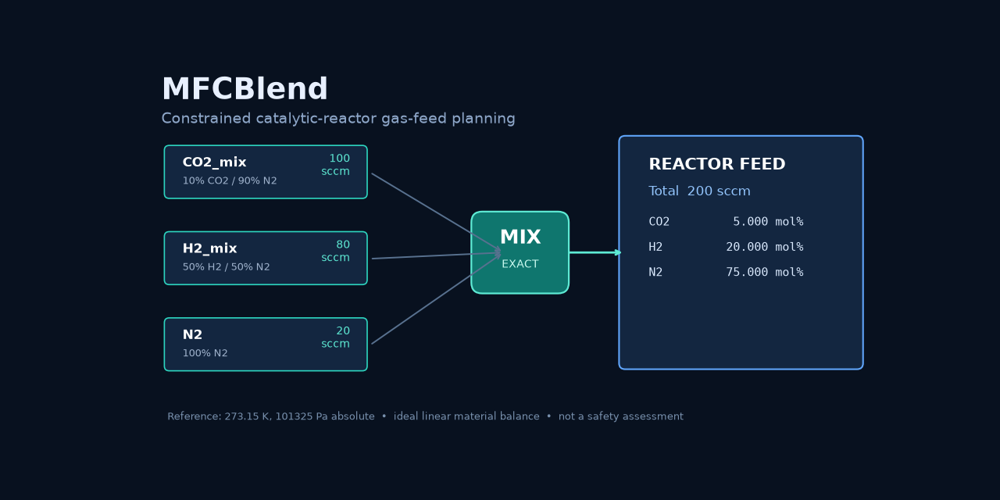

# MFCBlend

Vendor-neutral gas-feed planning for catalytic reactors using the cylinders and
mass-flow controllers (MFCs) that are actually available in the laboratory.

[](https://github.com/hdkim99/MFCBlend/actions/workflows/ci.yml)
[](https://github.com/hdkim99/MFCBlend/actions/workflows/macos.yml)
[](https://pypi.org/project/mfcblend/)



## Why

A target such as 5 mol% CO2 and 20 mol% H2 is not enough to set a reactor feed
when the laboratory owns premixed cylinders and MFCs with minimum, maximum, and
turndown limits. MFCBlend records those constraints, solves the general linear
mixing balance, and refuses to label an infeasible target as an exact plan.

MFCBlend is decision support, not instrument control, a reactor simulator, or a
flammability/process-safety certification tool.

## Install

Install the published package from PyPI:

```bash
python -m venv .venv
source .venv/bin/activate
python -m pip install mfcblend
```

To test unreleased source changes instead, install the public repository:

```bash
python -m pip install "git+https://github.com/hdkim99/MFCBlend.git"
```

The headless core and CLI do not import Tkinter, Qt, or a Matplotlib GUI backend.
For the desktop workflow and optional result figure support:

```bash
python -m pip install "mfcblend[gui]"
python -m mfcblend.gui
```

For a local checkout, use `python -m pip install .` or `python -m pip install
".[gui]"`.

## 30-second inverse example

`examples/co2_hydrogen_system.json` defines:

- 10% CO2 / N2, 50% H2 / N2, and pure N2 cylinders;
- each connected MFC's off/operating ranges and optional turndown;
- `sccm` referenced to 273.15 K and 101325 Pa absolute.

```bash
mfcblend inverse \
  examples/co2_hydrogen_system.json \
  examples/target_5co2_20h2.json \
  --output plan.json
```

The exact material-balance result is 100 sccm from the CO2 premix, 80 sccm from
the H2 premix, and 20 sccm N2, totaling 200 sccm. The output retains the target,
achieved composition, reference conditions, residuals, assumptions, and status.

Forward calculation uses the same core:

```bash
mfcblend forward \
  examples/co2_hydrogen_system.json \
  examples/setpoints_5co2_20h2.json \
  --output checked-feed.csv
```

## Scientific basis

For cylinder `j`, species `i`, and setpoint `q_j`, MFCBlend uses the steady
ideal-mixing balance

```text
component flow_i = sum_j(y_ij q_j)
mixture fraction_i = component flow_i / sum_j(q_j)
```

Inverse mode solves this generalized linear system subject to nonnegative MFC
flows and the stated limits. An MFC may be off, or it must be between its
effective minimum and maximum. When a turndown ratio is supplied, the effective
minimum is `max(stated minimum, full scale / turndown)`. Active MFC subsets are
enumerated (currently up to 16 MFCs) and each bounded linear least-squares problem
is solved with SciPy. Approximate results are opt-in and explicitly labelled.

Equivalent volumetric flow is converted to molar flow only with its explicit
reference conditions and the ideal-gas relationship `n_dot = P_ref Q_ref / (R
T_ref)`. NIST warns that `sccm` can use different reference temperatures. MFCBlend
therefore has no hidden default in configuration files.

Authoritative sources and equation-to-code links are in
[`docs/scientific-basis.md`](docs/scientific-basis.md).

## Python API

```python
from mfcblend import inverse_mix
from mfcblend.io import load_system

system = load_system("examples/co2_hydrogen_system.json")
result = inverse_mix(system, {"CO2": 0.05, "H2": 0.20}, 200.0)
assert result.status.value == "exact"
```

Importing `mfcblend`, `mfcblend.core`, or `mfcblend.cli` does not initialize a
GUI or Matplotlib backend.

## Validation

- unique hand calculation for the documented three-cylinder inverse problem;
- pure- and premixed-cylinder forward composition closure;
- exact overdetermined solve and deliberately infeasible target;
- MFC off/minimum/maximum/turndown boundaries;
- NIST-compatible `sccm` molar-flow regression at 0 °C and 1 atm;
- standard-condition conversion preserving ideal-gas molar flow;
- CLI/API/GUI equality and JSON/CSV export wiring;
- clean-wheel, headless CLI, Xvfb GUI lifecycle, and native macOS GUI smoke jobs.

Four public real-experiment feed cases now cover component-labelled channels,
premixed cylinders, N2/He internal standards, dry-basis dilution, same-geometry
inverse reconstruction, and a compositionally infeasible negative control.
Their DOI/PMCID, licenses, source-file checksums, exact calculations, unknown
metadata, and rejected candidates are in
[`docs/research/public-data-sources.md`](docs/research/public-data-sources.md)
and
[`docs/research/public-data-failures.md`](docs/research/public-data-failures.md).

## Supported scope and limitations

Implemented:

- arbitrary cylinder/species matrices on a molar-fraction basis;
- forward and inverse modes;
- exact, approximate, and infeasible status separation;
- off-or-operating MFC ranges and turndown;
- explicit `sccm`, `slm`, or `nml/min` reference temperature/pressure, or an
  explicit unknown state that blocks amount-flow conversion;
- ideal-gas molar flow, ideal partial pressure, reactant ratios, and GHSV API;
- JSON inputs and JSON/CSV result export.

Explicitly unsupported in 0.1.x:

- instrument communication or automatic setpoint application;
- non-ideal-gas corrections, calibration-gas correction factors, uncertainty,
  dynamics, pressure drops, and full reactor simulation;
- water saturators or condensable-feed phase equilibrium;
- WHSV without an explicit mass-flow model;
- flammability, explosion limits, gas compatibility, and safety certification.

An `exact` result means only that the stated ideal material-balance target can be
met within the supplied numerical tolerances and limits. It does not establish
that the physical setup is safe, calibrated, stable, or accurately mixed.

When a paper does not report MFC operating ranges, MFCBlend preserves `null`
instead of inventing a range. Its inverse result can be exact for composition
and total flow while still stating that instrument-range feasibility was not
assessed.

## Platforms and GUI

- Python 3.10–3.14;
- macOS 13+ is the stated target for Python.org/Homebrew CPython on Apple Silicon
  and Intel; combinations not exercised by CI are not claimed as verified;
- Tkinter/ttk is the only GUI framework; PyQt and PySide are not dependencies;
- CLI/headless operation works without GUI extras;
- plotting sets `Agg` inside the plotting entry point; Tk uses its native Tk
  event loop and never selects a Qt backend.

See [`docs/macos.md`](docs/macos.md) for verified combinations and diagnostic
commands.

## Development and citation

See [CONTRIBUTING.md](CONTRIBUTING.md), [SECURITY.md](SECURITY.md), and
[CITATION.cff](CITATION.cff). Version 0.1.1 is the current alpha release; 1.0.0 requires
external user experience and broader real-data validation.
